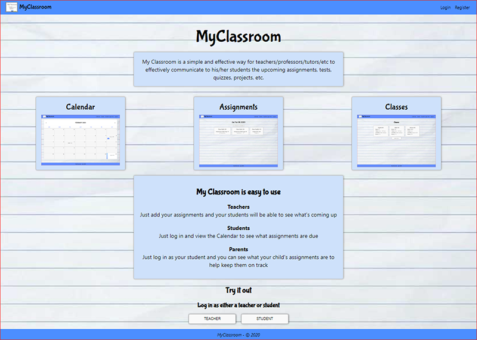
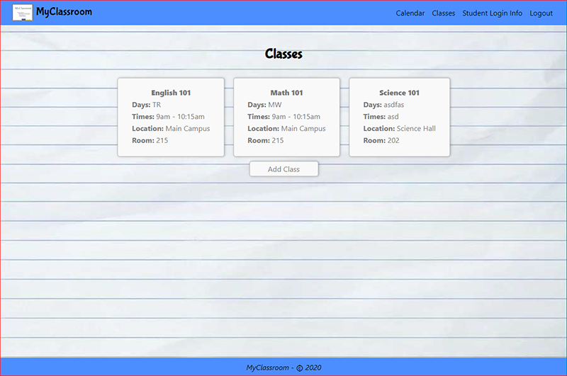

# MyClassroom 

My Classroom is a simple and effective way for teachers/professors/tutors/etc to effectively communicate to his/her students the upcoming assignments, tests, quizzes, projects, etc.

**Teachers:** Just add your assignments and your students will be able to see what's coming up

**Students:** Just log in and view the Calendar to see what assignments are due

**Parents:** Just log in as your student and you can see what your child's assignments are to help keep them on track

## Check it out
[https://myclassroom.now.sh/](https://myclassroom.now.sh/)


## Screenshots
***
#### Landing page: [https://myclassroom.now.sh/](https://myclassroom.now.sh/)


#### Calendar page:


#### List of Assignments per Day page:


#### Classes page:



## MyClassroom API
*******
### **Get all Assignments**
```
GET /api/assignments
```
### **Get an Assignment**
```
GET /api/assignments/id
```

### **Add an Assignment**
```
POST /api/assignments
```

### **Delete an Assignment**
```
DELETE /api/assignments/id
```

### **Update an Assignment**
```
PATCH /api/assignments/id
```

### **Get all Classes**
```
GET /api/classes
```

### **Get a Class**
```
GET /api/classes/id
```

### **Add a Class**
```
POST /api/classes
```

### **Delete a Class**
```
DELETE /api/classes/id
```

### **Update a Class**
```
PATCH /api/classes/id
```

### **Authenticate Login**
```
POST /api/auth/login
```

### **Authenticate Refresh**
```
POST /api/auth/refresh
```

### **Validate Users**
```
POST /api/users
```

## Source Code
MyClassroom Client: [https://github.com/cableredi/MyClassroom](https://github.com/cableredi/MyClassroom)

MyClassroom API: [https://github.com/cableredi/myclassroom-api](https://github.com/cableredi/myclassroom-api)

## Technology Used
```
HTML5, SCSS/CSS, Node.js, React, Express, PostgreSQL
```